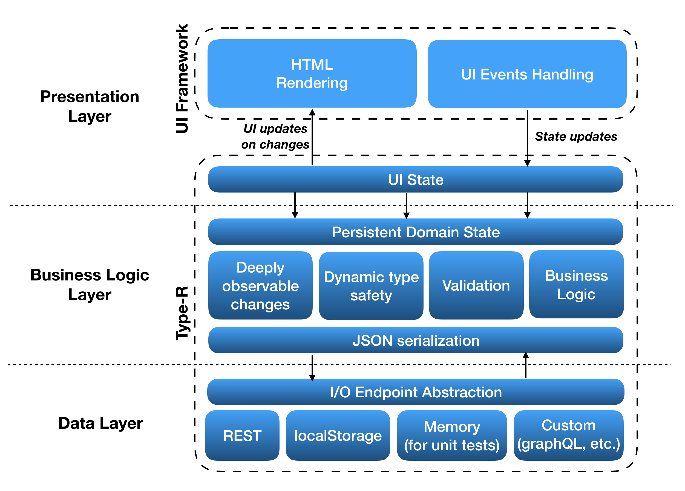

# Getting started

## Overview

Type-R is the JS model framework helping to define and manage the complex application state as a combination of reusable parts. Type-R cover the needs of business logic and data layers in 3-tier application architecture, provinding the presentation layer with the unified technique to handle the UI and domain state. Type-R data structures looks and feels (and, in some aspects, behaves) more like classes in the statically typed languages.

Type-R in unopinionated on the way how an application state should be managed ("single source of truth" or "distributed state"). It can support all approaches equally well being not dependent on singletons and having the powerful capabilities for state synchronization.



State is defined as a superposition of typed records and collections. Record is a class with known set of attributes of predefined types possibly holding other records and collections in its attributes, describing the data structure of an arbitrary complexity. Record with its attributes forms an aggregation tree with deeply observable attributes changes. Attribute types are checked on assignments and invalid changes are being rejected, therefore it is guaranteed that the application state will preserve the valid shape.

Application state defined with Type-R is serializable to JSON by default. Aggregation tree of records and collections is mapped in JSON as a tree of plain objects and arrays. Normalized data represented as a set of collections of records cross-referencing each other are supported as first-class serialization scenario.

Record may have an associated IOEndpont representing the I/O protocol for CRUD and collection fetch operations which enables the persistence API for the particual record/collection class pair. Some useful endpoints (`restfulIO`, `localStorageIO`, etc) are provided by `type-r/endpoints/*` packages, and developers can define their own I/O endpoints implementing any particular persistence transport or API.

Record attributes may have custom validation rules attached to them. Validation is being triggered transparently on demand and its result is cached across the record/collection aggregation tree, making subsequent calls to the validation API extremily cheap.

All aspects of record behavior including serialization and validation can be controlled on attribute level with declarative definitions combining attribute types with metadata. Attribute definitions ("metatypes") can be reused across different models forming the domain-specific language of model declarations. Some useful attribute metatypes (`Email`, `Url`, `MicrosoftDate`, etc) are provided by `type-r/ext-types` package.

## Features by example

### Persistent domain state

The basic building block is the `Record` class. To fetch data from the server, a developer creates the subclass of the `Record` describing its attribute types and attaches the `restfulIO` endpoint. It enables the persistence API allowing the developer to fetch the collection from the server. `restfulIO` expects the server to implement the standard RESTful API expected by BackboneJS models.

- `GET /api/users` - fetch all the users
- `POST /api/users` - create the user
- `GET /api/users/:id` - fetch the user with a given id
- `PUT /api/users/:id` - update the user with a given id
- `DELETE /api/users/:id` - delete the user with a given id

Record and collection are seralizable to and can be parsed from JSON with no additional effort, and can be customized for collections, records, and individual attributes. The Record checks all updates and cast attribute values to declared attribute types, protecting the state strucure from the protocol incompatibilities and improper assignments.

```javascript
@define User extends Record {
	static endpoint = restfulIO( '/api/users' );
	static attributes = {
		name : String,
		email : String,
		createdAt : Date
	}
}

const users = new User.Collection();
await users.fetch();

expect( users.first().createdAt ).toBeInstanceOf( Date );
expect( typeof users.toJSON()[ 0 ].createdAt ).toBe( "string" );
```

### UI state and observable changes

Type-R provides the universal technique to working with the UI and domain state. To define the UI state, a developer creates the subclass of the `Record` with attributes holding all the necessary state data possibly along with the presistent data which can become the part of the same local UI state. The UI state itself can be a part of some particular view or UI component, it can be managed as a singleton ("single source of truth"), or both at the same time. Type-R is unopinionated on the application state structure leaving this decision to the developer.

Records and collections forms an aggregation tree with deeply observable changes, so it's enough to subscribe to the single `change` event from the `UIState` to get updates on both data arrival and local changes of the state attributes. Records and collections can be indefinitely nested to describe a state of an arbitrary complexity. Developer can attach reactions on changes to the records, their individual attributes, and collections. Additional changes made in reactions will be executed in the scope of the same "change transaction" and won't trigger additional change events.


```javascript
@define UIState extends Record {
	static attributes = {
		users : User.Collection,
		selectedUser : User.from( 'users' )
	}
}

const uiState = new UIState();

uiState.on( 'change', () => {
	console.log( 'Something is changed' );
	updateUI();
});

uiState.users.fetch();
```

### Validation

Type-R supports validation as attribute-level checks attached to attribute definitions as a metadata. Attribute type together with checks forms an "attribute metatype", which can be defined separately and reused across multiple record definitions.

Validation rules are evaluated recursively on the aggregation tree on first access to the validation API, and validations results are cached in records and collections across the tree till the next update. The validation is automatic, subsequent calls to the validation API are cheap, and developer don't need to manually trigger the validation on data changes.

The majority of checks in a real application will be a part of attribute "metatypes", while the custom validation can be also defined on the `Record` and `Collection` level to check data integrity and cross-attributes dependencies.
  
```javascript
const Email = type( String )
    .check( x => !x || x.indexOf( '@' ) >= 0, "Doesn't look like an email" );

@define User extends Record {
	static endpoint = restfulIO( '/api/users' );
	static attributes = {
		name : type( String ).required,
		email : type( Email ).required,
		createdAt : type( Date ).check( x => x.getTime() <= Date.now() )
	}
}

const users = new User.Collection();
users.add({ email : 'john' });
expect( users.isValid() ).toBe( false );
expect( users.first().isValid() ).toBe( false );

users.first().name = "John";
users.first().email = "john@ny.com";
expect( users.isValid() ).toBe( true );
```

## Installation and requirements

Is packed as UMD and ES6 module. No peer dependencies are required.

`npm install type-r --save-dev`

<aside class="success">IE10+, Edge, Safari, Chrome, and Firefox are supported</aside>

<aside class="warning">IE9 and Opera may work but has not been tested. IE8 won't work.</aside>

## How Type-R compares to X?

Type-R (former "NestedTypes") project was started in 2014 in Volicon as a modern successor to BackboneJS models, which would match Ember Data in its capabilities to work with a complex state, while retaining the BackboneJS simplicity, modularity, and the some degree of backward API compatibility. It replaced BackboneJS in the model layer, and it was the key technology in Volicon's strategy to gradually move from BackboneJS Views to React in the view layer.

[Ember Data](https://guides.emberjs.com/v2.2.0/models/) is the closest thing to Type-R by its capabilities, with [BackboneJS models and collections](http://backbonejs.org/#Model) being the closest thing by the API and the general spirit, and [mobx](https://github.com/mobxjs/mobx) being pretty close in the way how the UI state is managed.

Type-R, however, takes very different approach to all three of them:

- Type-R distinguishes aggregation and the object references being built on the concept of _aggregation trees_ formed by nested records and collections. Operations like `clone()`, `dispose()`, `isValid()` and `toJSON()` are performed recursively on elements of aggregation tree gracefully handling the references to shared objects.
- In contract to BackboneJS, Record is _not an object hash_ but the class with statically typed and dynamically checked attributes.
- In contrast to mobx, Type-R detects _deeply nested changes_.
- In contrast to Ember Data, Type-R is built around the concept of aggregation trees and self-contained data structures, and it doesn't require the singleton global store.
- Type-R is one of very few data frameworks where the store is not required to be a singleton. In Type-R, stores are a special kind of records. There might be as many dynamically created and disposed stores as you need, starting with no stores at all.
- In contrast to all of them, Type-R models looks and feels more like classes in the statically typed language.

Feature | Type-R | Backbone Models | Ember Data | mobx
-|-|-|-|-
Observable changes in object graph | ✓ | - | - | ✓
JSON Serialization | ✓ | ✓ | ✓ | -
Validation | ✓ | ✓ | ✓ | -
Dynamic Type Safety | ✓ | - | for serialization only | -
Aggregation | ✓ | - | - | -
Relations by id | ✓ | - | ✓ | - 
Generalized I/O | ✓ | sync function | ✓ | - 
